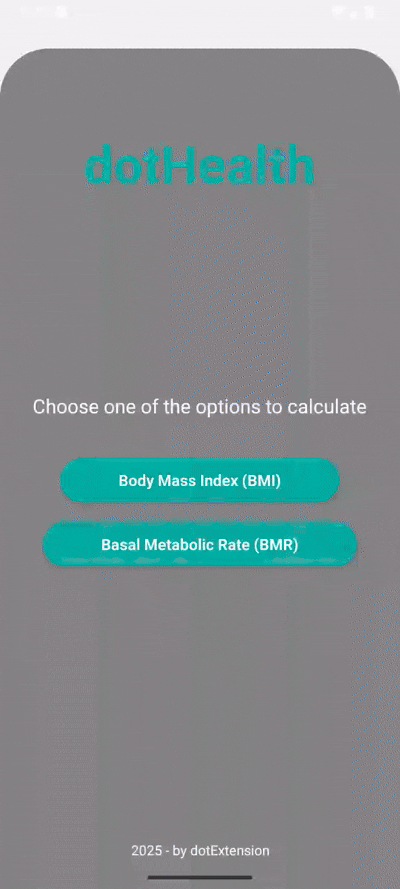

<h1 align="center">dotHealth</h1>

dotHealth is a simple and intuitive app that helps you calculate your Body Mass Index (BMI) and Basal Metabolic Rate (BMR) effortlessly. Whether you're on a journey to better health or just curious about your metrics, dotHealth is here to assist you. No account is required—just input your data, and get your results instantly. Key features include:
BMI Calculation: Determine your BMI based on your height and weight.
BMR Calculation: Calculate your daily calorie needs with our easy-to-use BMR calculator.
Simple and Clean Interface: User-friendly design with no distractions.
No Personal Data Collection: Your data stays on your device, ensuring complete privacy.
Completely Free: No in-app purchases or ads. Just a straightforward tool to help you stay on top of your health.

      

TECHNOLOGIES USED:

### Features

- [x] Design
- [x] Functionalities
- [x] Uploaded to Google Play Store

<h4 align="center"> 
	Google Play Store link to install dotHealth:
</h4>

https://play.google.com/store/apps/details?id=com.dotextension.dothealth

With ❤ by  

